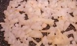
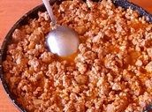
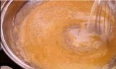
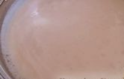
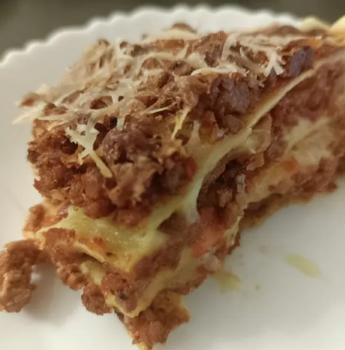

# Technical Report on “How to Cook Lasagna”

## **Overview**

Lasagna is a classic Italian dish consisting of layers of pasta, meat or vegetable sauce, creamy béchamel and cheese, baked to golden perfection. This report outlines the ingredients, equipment and step-by-step instructions for making lasagna at home.

## **Ingredients**

### **1. Pasta**

Lasagna sheets: 12 sheets

### 2. Meat Sauce (Bolognese)

- Ground beef: 500g
- Ground pork (optional): 200g
- Onion: 1 medium, finely chopped
- Garlic: 3 cloves, minced
- Tomatoes (diced): 2-3 pieces
- Tomato paste: 3 tbsp
- Olive oil: 2 tbsp
- Red wine (optional): 100ml
- Italian seasoning: 1 tbsp
- Salt and pepper: to taste

### 3. Béchamel Sauce

- Butter: 50g
- Flour: 50g
- Whole milk: 500ml
- Nutmeg (optional): a pinch
- Italian spices, salt and pepper: to taste

### **4.** Cheese

Parmesan/Tilsiter or any hard cheese: 200 g

## **Equipment**

- Baking dish (roughly 22.5x33 cm)
- Large skillet (roughly 24-32 cm)
- Medium saucepan (3-5 liters)
- Whisk
- Fine grater
- Spoon
- Oven (preheated to 190°C)

## **Preparation**

### Prepare the Meat Sauce

1. Heat the olive oil in a large skillet over medium heat.

1. Saute the onion until translucent (about 5 minutes), then add garlic and cook for 1 minute.

1. Add ground beef (and pork - optional), cooking until browned.

1. Add the tomato paste, canned tomatoes, and red wine (optional).

1. Season with Italian spices, salt and pepper to taste and bake for 20-30 minutes.

### Prepare the Béchamel Sauce

1. Melt butter in a saucepan over medium heat.
2. Add the flour in small batches, stirring constantly, and cook for 2-3 minutes.

1. Gradually add the milk, stirring constantly with a whisk to prevent lumps from forming.

1. Cook until thickened (5-7 minutes) and season with nutmeg, salt, and pepper to taste. 

### Prepare the cheese

Grate the cheese on a fine grater

## **Assembly**

1. Using a spoon, spread a thin layer (2-3 cm) of béchamel sauce on the bottom of the baking dish.
2. Lay down a layer of lasagna sheets.

1. Add a layer of béchamel sauce, then a layer of meat sauce.

1. Spread a portion of cheese.
2. Repeat the layers until all ingredients are used, finishing with meat sauce and cheese on top.

## **Bake**

1. Bake in preheated oven for 40 minutes.
2. Let lasagne rest for 10 minutes before serving. 

The lasagna is ready.

## **Tips and Notes**

**Texture:** Ensure that the pasta sheets are cooked to your desired level of softness by checking them while baking.
**Flavor enhancement:** You can add different herbs and spices, bay leaves or fresh basil to the meat sauce for extra depth of flavor.
**Storage:** Leftovers can be refrigerated for up to 3 days or frozen for up to 3 months.

## **Conclusion**

Preparing lasagna requires accuracy and care, from making the sauce to combining the layers with the right balance of ingredients. By following this guide, you can prepare a perfectly layered and delicious lasagna, suitable for any meeting or meal.
